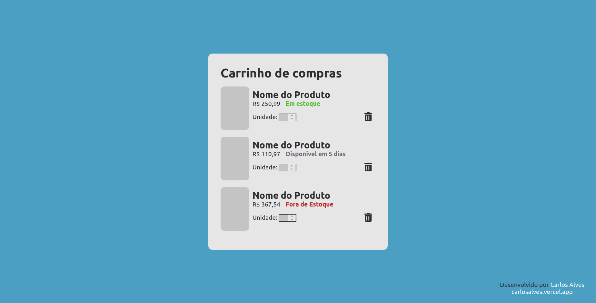

# Apresentação sobre React.js e Vite.js
## Descrição do projeto
⚛️ ⚡ Repositorio com o código e apresentação ensinando React JS e Vite JS

_Para ver a apresentação em PDF, [clique aqui](../../presentation/aplicacoes_react_com_vite_js.pdf)._

    
    
    
    
    

___
## O projeto

### Objetivo Geral: 
Criar uma apresentação com código simples de como usar React.js com Vite.js para criar aplicações web

<a href="https://eucarlos.github.io/react-and-vitejs-presentation/">Ver site em produção</a>

### Instalação

Clone o repositório:

    git clone https://github.com/EuCarlos/react-and-vitejs-presentation.git && cd react-and-vitejs-presentation

Install the dependencies using Yarn:

    yarn install // or -> npm install 

### Execute o projeto
Inicie o servidor do react:

    yarn dev // ou -> npm run dev

Build o projeto:

    yarn build // ou -> npm run build
___

Criado de 💜 por <a href="https://github.com/eucarlos/">Carlos Alves</a>

